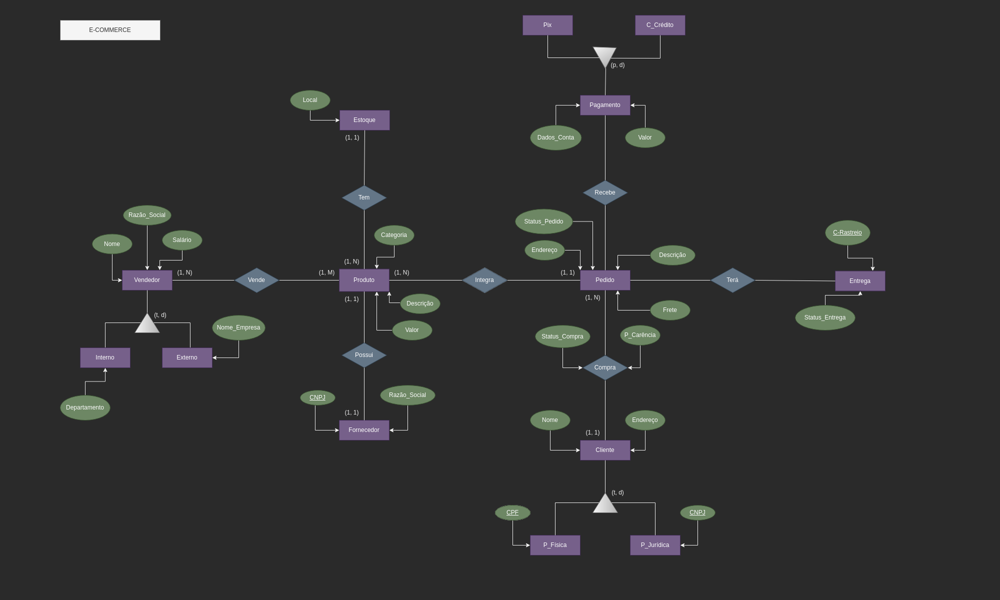

# 🚀 INFORMATIONS:

### 🔎 OBJECTIVE: **Model a reduced e-commerce context with the ER Model**
- Bootcamp Database Experience Project -> ​**DIO (Digital Innovation One)**

### 🔧 TOOLS AND TECHNOLOGIES USED:
- ​**ER Model:** [Draw.io](https://app.diagrams.net/) 

### 💡 IDEAS IMPLEMENTED: 
- **New entities**;
- ​**Specialization of some entities**.

### 🧗‍♂️ STEP BY STEP:
1. Download the image available in the folder;
2. Open [Draw.io](https://app.diagrams.net/);
3. Click **"Open Existing Diagram"**;
4. Select the downloaded image;
5. Change as you wish :)

### RESULTS:
